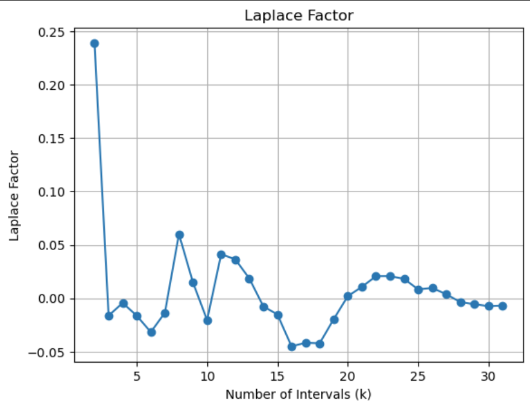
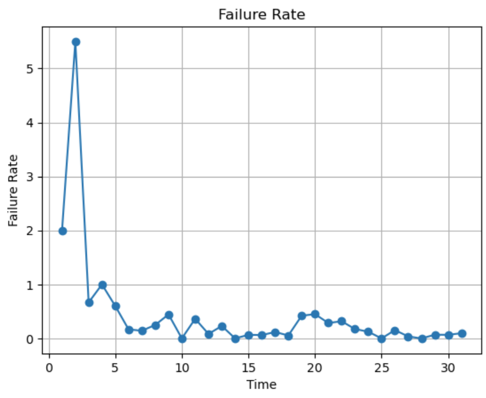

**SENG 637- Dependability and Reliability of Software Systems***

**Lab. Report \#5 – Software Reliability Assessment**

| Group \#:       |   |
|-----------------|---|
| Student Names:  |   |
|                 |   |
|                 |   |
|                 |   |

# Introduction

# 

# Assessment Using Reliability Growth Testing 

## Reliability

The laplace test helps provide a method for assessing the effectiveness of reliability improvement over time. In reliability growth testing, the goal is to identify and correct failures early in the development process to enhance the reliability of the product or system.

By comparing the actual failure data to the expected failure distribution based on reliability improvement goals, the Laplace test helps identify deviations from the expected trend. These deviations can indicate whether the reliability growth process is progressing as anticipated or if further actions are necessary.

  

As expected, we can see the decreased reliability at the beginning and then the slow decrease does indicate some reliability growth. 

## Failure Rate

Below plots the failure rate for the given test data.

  

# Assessment Using Reliability Demonstration Chart 

# 

# Comparison of Results

Reliability Demonstration Testing (RDT) and Reliability Growth Testing (RGT) are both methods used in testing to assess and improve the reliability of a product. RDT focuses on whether a product meets its reliability requirements/specs before released to customers, while RGT is conducted during development to identify and fix reliability issues before release. 

The RGT phase, we focused on DW3 and GM models which seemed most suitable for the data given. After evaluating AIC and BIC across the different models, we found covariate F with the best results. Additionally, we determined the range of useful data for analysis, excluding the initial 'infant mortality' phase and focusing on intervals where the system's performance stabilized. Considering project requirements and monitoring the trend of failure rates over time are essential for defining an acceptable range of failure rate in RGT analysis.

For the RDT phase, the Chart shows that the a mean time to failure (MTTF) of 2 time units represents the minimum reliable operational interval (MTTFmin) for the system, as observed failures consistently remained within the acceptable region on the RDC. Values below this threshold, such as an MTTF of 1 unit, resulted in insufficient reliability, while higher values, such as 4 units, indicated a conservative estimate. The RDC serves as a visual tool to guide decisions regarding the product's reliability level and improvement efforts throughout the testing process.

Overall, RGT and RDT are techniques that are optimized for different things. The RGT helps predict the behaviour of failure trends, and the RDC displays the decision making of when testing can stop based on different factors. 

# Discussion on Similarity and Differences of the Two Techniques

# How the team work/effort was divided and managed

# 

# Difficulties encountered, challenges overcome, and lessons learned

# Comments/feedback on the lab itself
